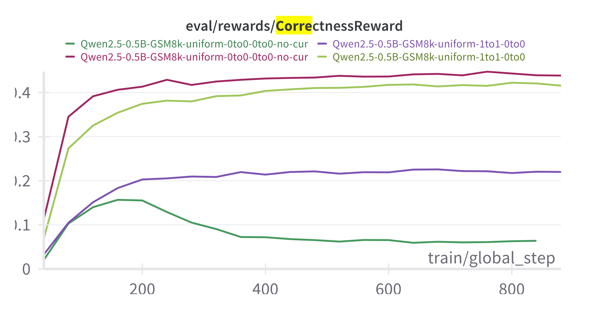
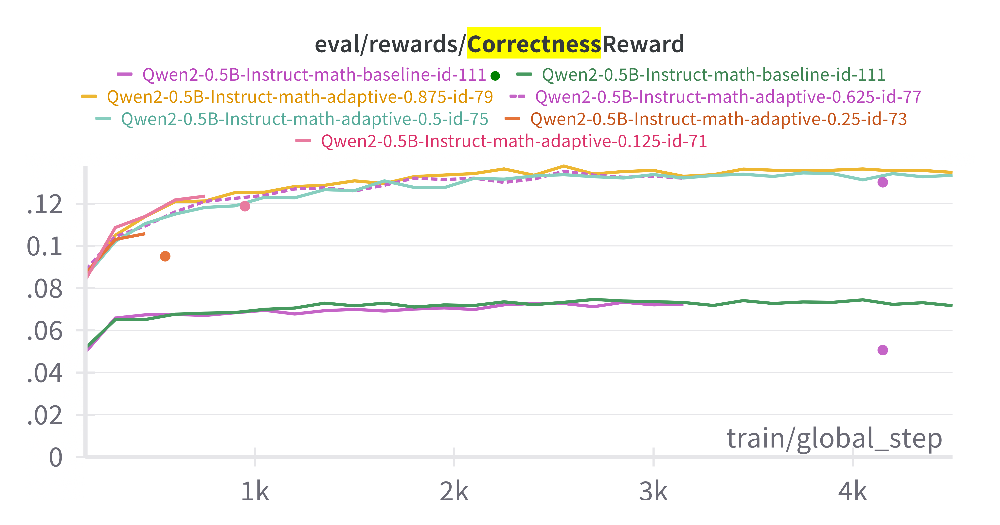
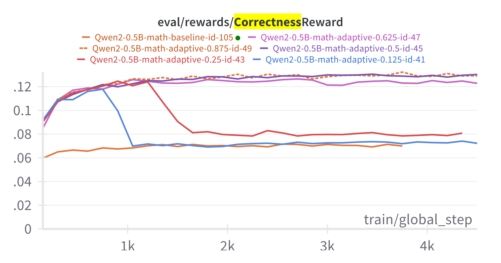
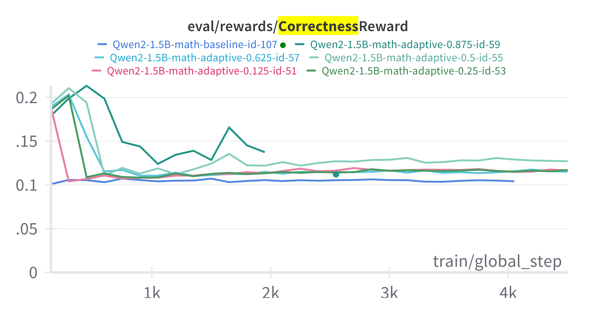
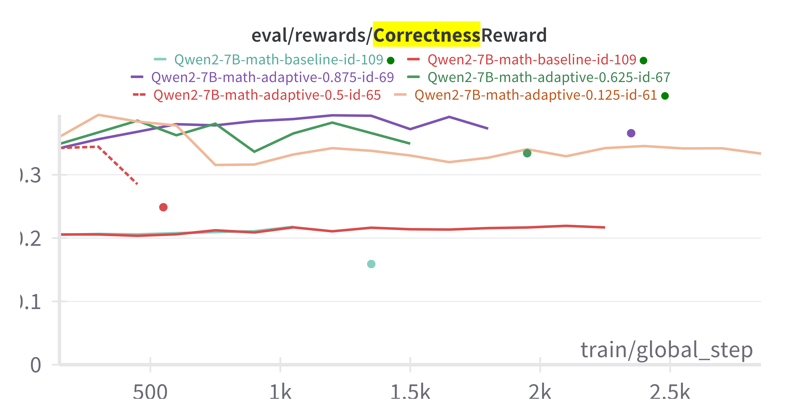

# Results up to April 3

## Inconsistency between version 15.2 and 16

The results that we get with the trl library version 0.15.2 and version 0.16.0 (two consecutve versions) are totally inconsistent. With 0.15.2 we see that the curriculum helps with GSM8k and Qwen0.5B while this gain disappears with version 0.16.0 where our results are generally much better (with and w.o. curriculum).

## Results with the adaptive curriculum

We conducted a series of experiments with the adaptive curriculum model with the following setting:
- dataset: GSM8k and MATH
- models: Phi4, Qwen {instuct, _} $\times$ {0.5B, 1.5B, 7B}
- adaptive threshold: baseline + {0.125, 0.25, ..., 0.875}

Summary of results:\
We did not observe any significant behavior when curriculum was used for the GSM8k dataset. Actually, the training reward for the baseline for different sizes reaches almost 1, which shows that curriculum might not indeed be helpful.

 On the other hand, for MATH, some models gave us a boost. In particular, non-instruct Qwen models and Qwen-0.5B-instruct gave us an almost 100% boost. 

Another observation that often quite frequently was that the evaluation accuracy starts to drop after some time while the train accuracy (reward) continues to go up. 